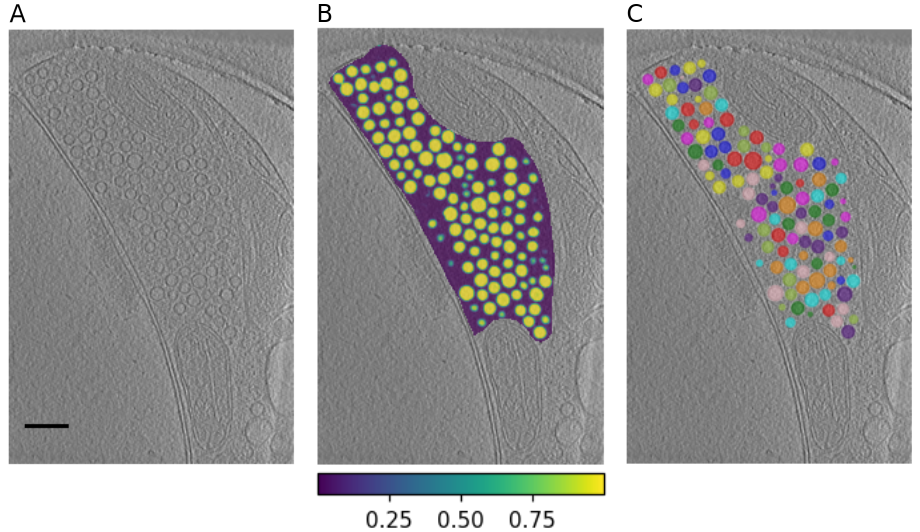

## Results

To automize the tracing of cellular features in tomograms, also called segmentation, we developed a deep-learning pipeline, which segments 3D objects.
-> similar approaches in 2D
The manual segmentation of synaptic vesicles is one of the most time-intensive steps, when segmenting tomograms of presynaptic terminals.
Synaptic vesicles also constitute a large, homogeneous group, which would create a large training set for deep learning applications.
Therefore, we decided to develop the automatic segmentation for synaptic vesicles in an initial step.
The used tomograms were previously manually segmented with IMOD [@doi:10.1006/jsbi.1996.0013].
In a next step, filaments connecting the synaptic vesicles with each other (connectors) and to the active zone (AZ) were automatically segmented with the algorithm application Pyto [@doi:10.1016/j.jsb.2016.10.004].

{#fig:pipeline width="15cm"}

{#fig:tom width="15cm"}

![**Dice Imporvment** Dice improvements after post processing of initial predicted mask (different colors correspond to different tomograms ): a) training datasets b) synaptosome test datasets c) Neuron test datasets(images/improvment-neurons.png){#fig:tom width="15cm"}

{#fig:radial_profile width="15cm"}

Fig 6- Splitting adjacent vesicles. A) Examples of tomogram, no labels; B) raw label with connected vesicle-labels; C) modified label with seperated vesicles ---> for software: IMOD

### Comparison of manual segmentation with automatic deep-learning based segmentation

{#fig:3d width="15cm"}

Evaluation metric DICE for pixel/pixel analysis

Table 1- Evaluation of the segmentation- MDICE: Mask Dice coefficient for the predicted mask PDICE: Dice coefficient after post-processing SIGMA-d: diameter error on correctly detected vesicle, DELTA-c: average error center (nm) #Vesicles: number of expected vesicles TP: True Positive FN: False Negative FP: False Positive

# Final Eval Tables

## Train Dataset

| **_Dataset_**  | **_Mask DICE_** | **_Final Label DICE_** |     | **_δ d_** | **_Δ c (nm)_** | **_\# of Vesicles_** |   **TP**   |  **FN**   |  **FP**   |
| -------------- | :-------------: | :--------------------: | :-: | :-------: | :------------: | :------------------: | :--------: | :-------: | :-------: |
| Synaptosome C1 |      0.44       |          0.73          |     |   0.07    |   2.55±1.56    |         223          |    198     |    26     |    49     |
| Synaptosome C2 |       0.8       |          0.9           |     |   0.05    |   2.12±1.06    |         105          |    103     |     2     |     1     |
| Synaptosome C3 |      0.67       |          0.9           |     |   0.05    |   1.86±1.24    |         128          |    127     |     1     |     6     |
| Synaptosome C4 |      0.62       |          0.89          |     |   0.03    |   1.78±0.92    |         144          |    141     |     3     |     4     |
| Synaptosome C5 |      0.58       |          0.87          |     |   0.04    |   1.86±1.00    |         214          |    209     |     5     |    13     |
| Synaptosome C6 |      0.56       |          0.84          |     |   0.04    |   1.92±1.05    |         104          |    102     |     2     |    16     |
| Synaptosome C7 |      0.78       |          0.88          |     |   0.06    |   1.86±0.90    |         184          |    184     |     0     |    16     |
| Synaptosome C8 |      0.75       |          0.9           |     |   0.05    |   1.70±0.93    |         132          |    126     |     6     |     1     |
| Synaptosome C9 |      0.59       |          0.87          |     |   0.05    |   1.87±0.91    |         135          |    132     |     3     |    14     |
| **Average**    |  **0.64±0.11**  |     **0.86±0.05**      |     | **0.05**  | **1.95±1.08**  |      **152.22**      | **97.00%** | **3.00%** | **7.30%** |

## Test Dataset (Same preparation and microscope with training set)

| **_Dataset_**   | **_Mask DICE_** | **_Final Label DICE_** |     | **_δ d_** | **_Δ c (nm)_** | **_\# of Vesicles_** |   **TP**   |  **FN**   |  **FP**   |
| --------------- | :-------------: | :--------------------: | :-: | :-------: | :------------: | :------------------: | :--------: | :-------: | :-------: |
| Synaptosome C10 |      0.75       |          0.88          |     |   0.07    |   1.86±1.18    |         129          |    123     |     6     |     5     |
| Synaptosome T1  |      0.75       |          0.83          |     |   0.11    |   2.66±1.52    |         699          |    687     |    12     |    33     |
| Synaptosome T2  |      0.74       |          0.77          |     |   0.11    |   2.27±1.84    |         122          |    117     |     5     |     2     |
| Synaptosome T3  |      0.72       |          0.74          |     |   0.11    |   3.64±2.22    |         434          |    397     |    37     |    57     |
| Synaptosome T5  |      0.77       |          0.85          |     |   0.08    |   2.20±1.26    |         535          |    526     |     9     |    25     |
| Synaptosome T6  |       0.6       |          0.83          |     |   0.07    |   2.02±1.12    |         373          |    353     |    20     |    42     |
| Synaptosome T7  |       0.8       |          0.83          |     |   0.06    |   2.22±1.14    |         110          |    107     |     3     |     9     |
| Synaptosome T8  |      0.83       |          0.91          |     |   0.04    |   2.09±1.04    |         100          |     99     |     1     |     2     |
| Synaptosome T10 |      0.77       |          0.86          |     |   0.05    |   1.96±1.04    |          77          |     74     |     3     |     6     |
| **Average**     |  **0.75±0.06**  |     **0.83±0.05**      |     | **0.08**  | **2.32±1.43**  |      **286.56**      | **96.30%** | **3.70%** | **6.10%** |

## Test Dataset 3 (Neuron Dataset)

| **_Dataset_** | **_Mask DICE_** | **_Final Label DICE_** |     | **_δ d_** | **_Δ c (nm)_** | **_\# of Vesicles_** |   **TP**   |   **FN**   |  **FP**   |
| ------------- | :-------------: | :--------------------: | :-: | :-------: | :------------: | :------------------: | :--------: | :--------: | :-------: |
| Neuron 133    |      0.76       |          0.86          |     |   0.05    |   2.16±1.32    |         523          |    467     |     56     |     8     |
| Neuron 123    |      0.64       |          0.71          |     |   0.05    |   2.05±1.18    |          66          |     58     |     8      |     2     |
| Neuron 84     |      0.86       |          0.89          |     |   0.06    |   1.44±0.75    |         498          |    484     |     14     |     1     |
| Neuron 134    |      0.56       |          0.67          |     |   0.09    |   2.87±2.50    |         638          |    384     |    254     |    63     |
| Neuron 115    |      0.57       |          0.63          |     |   0.08    |   3.56±3.23    |         170          |    123     |     47     |    32     |
| Neuron 102    |      0.73       |          0.86          |     |   0.05    |   1.47±0.79    |         103          |     86     |     17     |     1     |
| Neuron 80     |       0.7       |          0.81          |     |   0.07    |   2.67±2.00    |         111          |    102     |     9      |     3     |
| Neuron 114    |      0.65       |          0.73          |     |   0.07    |   2.68±1.79    |         131          |     93     |     38     |     9     |
| Neuron 132    |      0.69       |          0.87          |     |   0.03    |   1.65±1.26    |         135          |    129     |     6      |    32     |
| Neuron 73     |      0.78       |          0.83          |     |   0.06    |   2.93±2.00    |         526          |    483     |     43     |     2     |
| Neuron 128    |      0.67       |          0.85          |     |   0.04    |   2.33±1.70    |         252          |    232     |     20     |    19     |
| Neuron 116    |      0.62       |          0.73          |     |   0.07    |   2.38±1.82    |         296          |    207     |     89     |    35     |
| **Average**   |  **0.69±0.09**  |     **0.79±0.09**      |     | **0.06**  | **2.35±1.83**  |      **287.42**      | **83.60%** | **16.40%** | **7.90%** |

Global analysis

{#fig:dice width="15cm"}

3d unet good for 3D processing
recent Nature methods paper by Ben Engel, DeepFinder -> Relion for STA creates mask to find more using dl
-what are they doing, maybe compare that in the text, different aims; we might compare results we achieve (keep as bonus, revision)

3 different types of dl: classification, localization and segmentation
We specialize in accuratly segmenting 3D svs -> results
through the network, output is a mask, smooth DICE/ binary DICE = which one for our mask? one function for both? -> Amin will check
when we encounter error until now we remove sv(?), bug inside function -> fix bug for better performance, how many fail and why?
evaluation: objectwise evaluation for I/O, radius, center (according to nature paper) -> compare with manual seg
other common evaluation tool other than DICE (Amin wants to check)
